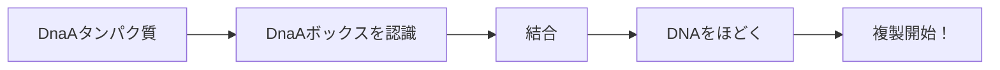
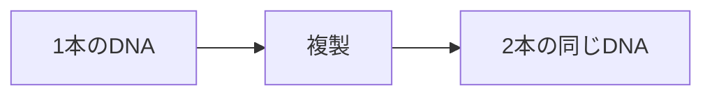

# バイオインフォマティクス用語集（超詳細版）

## 🌟 初学者の方へ

この用語集は、プログラマーが生物学を学ぶ際に躓きやすい用語を超丁寧に説明しています。
各用語には以下が含まれています。

- 簡単な定義
- プログラマー向けの例え
- 詳しい説明
- コード例（該当する場合）

---

## A

### Algorithm（アルゴリズム）

- 簡単な定義：問題を解決するための手順
- プログラマー向け：まさにあなたが普段書いているもの
- 詳しい説明：バイオインフォマティクスでは、生物学的な問題をコンピュータで解くためのアルゴリズムを開発する

```python
# 例：DNAの中から特定のパターンを探すアルゴリズム
def find_pattern(dna, pattern):
    positions = []
    for i in range(len(dna) - len(pattern) + 1):
        if dna[i:i+len(pattern)] == pattern:
            positions.append(i)
    return positions
```

### Adenine（アデニン）

- 簡単な定義：DNAを構成する4つの塩基の1つ。「A」で表記
- プログラマー向け：4進数の「0」のようなもの
- 詳しい説明
- 必ずチミン（T）とペアを作る（A-T塩基対）
- 水素結合2本で結合
- プリン塩基の一種

---

## C

### Chromosome（染色体）

- 簡単な定義：DNAがぎゅっと凝縮されたもの
- プログラマー向け：圧縮ファイル（.zip）のようなもの
- 詳しい説明
- 人間は46本（23対）の染色体を持つ
- 細胞分裂の時だけこの形になる
- 普段のDNAは糸のように伸びている

### Complement（相補）

- 簡単な定義：DNAの塩基がペアを作る性質
- プログラマー向け：

```python
complement = {'A': 'T', 'T': 'A', 'G': 'C', 'C': 'G'}
```

- 詳しい説明：DNAの二本鎖は相補的な関係にある。

```
5' ATGC 3'  ← 上の鎖
   ||||
3' TACG 5'  ← 下の鎖（相補鎖）
```

### Cytosine（シトシン）

- 簡単な定義：DNAを構成する4つの塩基の1つ。「C」で表記
- プログラマー向け：4進数の「1」のようなもの
- 詳しい説明：
- 必ずグアニン（G）とペアを作る（C-G塩基対）
- 水素結合3本で結合（A-Tより強い）
- ピリミジン塩基の一種

---

## D

### DNA（デオキシリボ核酸 / Deoxyribonucleic Acid）

- 簡単な定義：生命の設計図
- プログラマー向け：ソースコード（永続化された情報）
- 詳しい説明：

```
構造：
- 二重らせん構造
- 4種類の塩基（A, T, G, C）
- 糖-リン酸骨格

役割：
- 遺伝情報の保存
- 次世代への情報伝達
- タンパク質合成の指示
```

### DnaA

- 簡単な定義：DNA複製を開始させるタンパク質
- プログラマー向け：main()関数を呼び出すランタイムのようなもの
- 詳しい説明：



### DnaA Box（DnaAボックス）

- 簡単な定義：DnaAタンパク質が結合する9文字のDNA配列
- プログラマー向け：

```python
# マジックナンバーのようなもの
DNAA_BOX = "ATGATCAAG"  # この特定の配列が重要！
```

- 詳しい説明：
- 長さ：9塩基（なぜ9　→短すぎず長すぎない絶妙な長さ）
- 複製起点に3-4個集中して存在
- 少し違う配列（1文字違い）でも機能することがある

### DNA Polymerase（DNAポリメラーゼ）

- 簡単な定義：DNAをコピーする酵素
- プログラマー向け：`memcpy()`関数のようなもの
- 詳しい説明：

```python
# DNAポリメラーゼの動作イメージ
def dna_polymerase(template_strand):
    new_strand = ""
    for base in template_strand:
        new_strand += complement[base]  # 相補的な塩基を追加
    return new_strand
```

特徴。

- 3'→5'方向にしか読めない（一方向性）
- 1秒間に約1000塩基をコピー
- エラー率：10億分の1（超正確）

---

## F

### Frequent Words Problem（頻出語問題）

- 簡単な定義：文字列中で最も多く出現するパターンを見つける問題
- プログラマー向け：

```python
# WordCountのDNA版
text = "ATGATGATG"
k = 3
# "ATG"が2回で最頻出
```

- 詳しい説明：なぜ重要
- DnaAボックスは複製起点に集中
- 頻出パターン = DnaAボックス候補
- 複製起点の位置を推定できる

---

## G

### Genome（ゲノム）

- 簡単な定義：生物が持つ全遺伝情報
- プログラマー向け：プロジェクトの全ソースコード
- 詳しい説明：

```
サイズの例：
- ウイルス: 数KB（小さなスクリプト）
- 細菌: 数MB（中規模アプリ）
- 人間: 3GB（大規模システム）
```

### GC Content（GC含量）

- 簡単な定義：DNA中のGとCの割合
- プログラマー向け：

```python
def gc_content(dna):
    gc_count = dna.count('G') + dna.count('C')
    return gc_count / len(dna) * 100
```

- 詳しい説明：
- 通常40-60％程度
- 高いGC含量 = 熱に強い（G-C結合は3本の水素結合）
- 種によって特徴的な値を持つ

### GC Skew（GCスキュー）

- 簡単な定義：GとCの出現頻度の偏り
- プログラマー向け：

```python
skew = g_count - c_count  # 位置までのGの数 - Cの数
```

- 詳しい説明：
- DNA複製の非対称性により生じる
- スキューが最小 = 複製起点の可能性
- グラフ化すると特徴的なパターンが見える

### Guanine（グアニン）

- 簡単な定義：DNAを構成する4つの塩基の1つ。「G」で表記
- プログラマー向け：4進数の「2」のようなもの
- 詳しい説明：
- 必ずシトシン（C）とペアを作る（G-C塩基対）
- 最も安定した結合（水素結合3本）
- プリン塩基の一種

---

## H

### Hamming Distance（ハミング距離）

- 簡単な定義：2つの文字列で異なる位置の数
- プログラマー向け：

```python
def hamming_distance(s1, s2):
    return sum(c1 != c2 for c1, c2 in zip(s1, s2))

# 例
hamming_distance("ATGC", "ATCC") # = 1
```

- 詳しい説明：
- 配列の類似性を測る基本的な指標
- ミスマッチを許容する検索で使用
- 進化的な距離の推定にも利用

---

## K

### k-mer（ケーマー）

- 簡単な定義：長さ`k`の部分文字列
- プログラマー向け：

```python
# substring(i, i+k) のこと
text = "ATGATG"
k = 3
# k-mers: "ATG", "TGA", "GAT", "ATG"
```

- 詳しい説明：
- バイオインフォマティクスの基本概念
- ゲノムアセンブリで重要
- kの選び方が解析の鍵

---

## L

### Lagging Strand（ラギング鎖 / 遅延鎖）

- 簡単な定義：DNA複製で断片的に合成される鎖
- プログラマー向け：非同期処理のようなもの
- 詳しい説明：

```
複製フォークの進行方向と逆向き
→ 連続的に複製できない
→ 岡崎フラグメントという断片で複製
→ 後で連結
```

### Leading Strand（リーディング鎖 / 先導鎖）

- 簡単な定義：DNA複製で連続的に合成される鎖
- プログラマー向け：同期処理のようなもの
- 詳しい説明：

```
複製フォークの進行方向と同じ
→ 連続的に複製可能
→ 1つのDNAポリメラーゼで完了
```

---

## M

### Mismatch（ミスマッチ）

- 簡単な定義：配列が一致しない箇所
- プログラマー向け：

```python
"ATGC" vs "ATCC"  # 3番目がミスマッチ
```

- 詳しい説明：
- 進化による変異
- シーケンシングエラー
- ミスマッチを許容することで柔軟な検索が可能

### Motif（モチーフ）

- 簡単な定義：生物学的に意味のある配列パターン
- プログラマー向け：デザインパターンのようなもの
- 詳しい説明：
- 例：DnaAボックス、プロモーター配列
- 進化的に保存されている
- 重要な機能を持つことが多い

---

## N

### Nucleotide（ヌクレオチド）

- 簡単な定義：DNAの構成単位
- プログラマー向け：char型の文字（A, T, G, C）
- 詳しい説明：

```
構成要素：
1. 塩基（A, T, G, C）
2. 糖（デオキシリボース）
3. リン酸基

これら3つで1ヌクレオチド
```

---

## O

### Okazaki Fragment（岡崎フラグメント）

- 簡単な定義：ラギング鎖で作られる短いDNA断片
- プログラマー向け：チャンク処理のチャンクのようなもの
- 詳しい説明：
- 長さ：1000-2000塩基
- 後でDNAリガーゼが連結
- 岡崎令治博士が発見

### OriC（Origin of Replication / 複製起点）

- 簡単な定義：DNA複製が始まる場所
- プログラマー向け：プログラムのエントリーポイント（main関数）
- 詳しい説明：

```python
# OriCの特徴
def is_ori_c(region):
    # DnaAボックスが集中している
    dnaa_box_count = count_pattern(region, "ATGATCAAG")
    return dnaa_box_count >= 3  # 3個以上あれば候補
```

---

## P

### Pattern（パターン）

- 簡単な定義：探したい文字列
- プログラマー向け：正規表現の検索パターンのようなもの
- 詳しい説明：

```python
text = "ATGATGATG"
pattern = "ATG"  # これがパターン
# このパターンは2回出現
```

### Pattern Matching（パターンマッチング）

- 簡単な定義：文字列から特定のパターンを探す処理
- プログラマー向け：`string.find()` や `grep` と同じ
- 詳しい説明：
- 完全一致
- 近似一致（ミスマッチ許容）
- 正規表現マッチング

### Primer（プライマー）

- 簡単な定義：DNA合成の開始点となる短いDNA/RNA
- プログラマー向け：関数の引数のようなもの
- 詳しい説明：
- PCRで使用
- 通常18-25塩基
- 相補的な配列に結合

---

## R

### Replication（複製）

- 簡単な定義：DNAをコピーすること
- プログラマー向け：`git clone` のようなもの
- 詳しい説明：



### Replication Fork（複製フォーク）

- 簡単な定義：DNA複製時にDNAがY字型に開いた部分
- プログラマー向け：zipファイルを開くジッパーのようなもの
- 詳しい説明：

```
    /← リーディング鎖
---<
    \← ラギング鎖
```

### Reverse Complement（逆相補鎖）

- 簡単な定義：DNAを逆向きにして相補的に変換したもの
- プログラマー向け：

```python
def reverse_complement(dna):
    complement = {'A':'T', 'T':'A', 'G':'C', 'C':'G'}
    return ''.join(complement[base] for base in dna[::-1])

# 例
# "ATGC" → "GCAT"
```

- 詳しい説明：

- DNAは逆並行なので重要
- 両方向を考慮する必要がある

### RNA（リボ核酸 / Ribonucleic Acid）

- 簡単な定義：DNAの一時的なコピー
- プログラマー向け：RAMメモリ（一時的な作業領域）
- 詳しい説明：

```
DNAとの違い：
- T（チミン）の代わりにU（ウラシル）
- 一本鎖が主
- 不安定（すぐ分解される）
```

---

## S

### Sequence（配列 / シーケンス）

- 簡単な定義：文字の並び
- プログラマー向け：string型の変数
- 詳しい説明：

```python
dna_sequence = "ATGATCAAG"
protein_sequence = "MKLFWLLFTIGFCFA"
```

### Sequencing（シーケンシング）

- 簡単な定義：DNAの配列を読むこと
- プログラマー向け：ファイルを読み込むようなもの
- 詳しい説明：
- 次世代シーケンサー（NGS）
- 1回で数億の配列を読める
- エラー率：0.1-1％程度

### Skew（スキュー）

- 簡単な定義：偏り、傾き
- プログラマー向け：累積和のようなもの
- 詳しい説明：

```python
# GCスキューの計算
skew = 0
for nucleotide in dna:
    if nucleotide == 'G': skew += 1
    elif nucleotide == 'C': skew -= 1
```

---

## T

### Thymine（チミン）

- 簡単な定義：DNAを構成する4つの塩基の1つ。「T」で表記
- プログラマー向け：4進数の「3」のようなもの
- 詳しい説明：
- 必ずアデニン（A）とペアを作る（T-A塩基対）
- RNAではウラシル（U）に置き換わる
- ピリミジン塩基の一種

### Transcription（転写）

- 簡単な定義：DNAからRNAを作ること
- プログラマー向け：コンパイルのようなもの
- 詳しい説明：

```
DNA → RNA → タンパク質
    転写   翻訳
```

### Translation（翻訳）

- 簡単な定義：RNAからタンパク質を作ること
- プログラマー向け：実行のようなもの
- 詳しい説明：
- 3文字（コドン）= 1アミノ酸
- 64通りのコドン → 20種類のアミノ酸

---

## その他の重要な概念

### 5' and 3'（5プライム・3プライム）

- 簡単な定義：DNAの方向を示す記号
- プログラマー向け：配列のインデックス（始点と終点）
- 詳しい説明：

```
5' ATGC 3'  ← この方向で読む
DNAポリメラーゼは5'→3'方向に進む
```

### Base Pair（塩基対 / bp）

- 簡単な定義：相補的な2つの塩基のペア
- プログラマー向け：key-valueペアのようなもの
- 詳しい説明：
- A-T：水素結合2本
- G-C：水素結合3本（より強い）
- 1 bp = DNAの長さの単位

### Codon（コドン）

- 簡単な定義：3文字の塩基配列（アミノ酸を指定）
- プログラマー向け：

```python
codon_table = {
    'ATG': 'Met',  # メチオニン（開始コドン）
    'TAA': 'Stop', # 終止コドン
    # ... 全64通り
}
```

- 詳しい説明：
- 64通り（4^3）のコドン
- 20種類のアミノ酸 + 終止信号
- 冗長性がある（複数のコドンが同じアミノ酸）

---

## 📚 学習のコツ

1. 英語の用語も覚える
   - 論文は英語
   - ツールのドキュメントも英語

2. 略語に慣れる
   - bp = base pair
   - nt = nucleotide
   - aa = amino acid

3. プログラミングと関連付ける
   - DNA = ソースコード
   - RNA = コンパイル済みコード
   - タンパク質 = 実行結果
